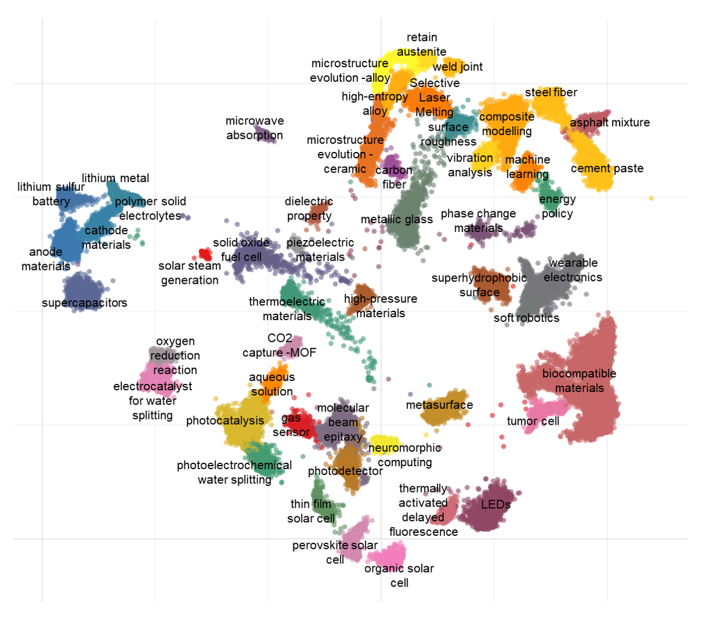
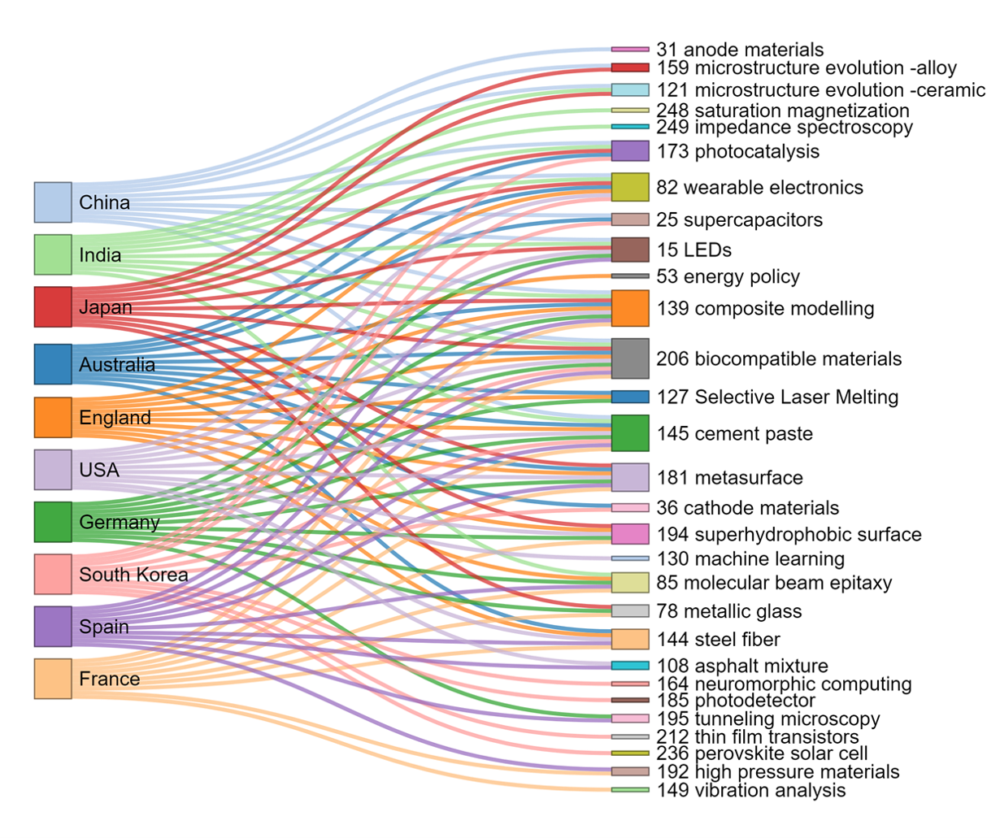
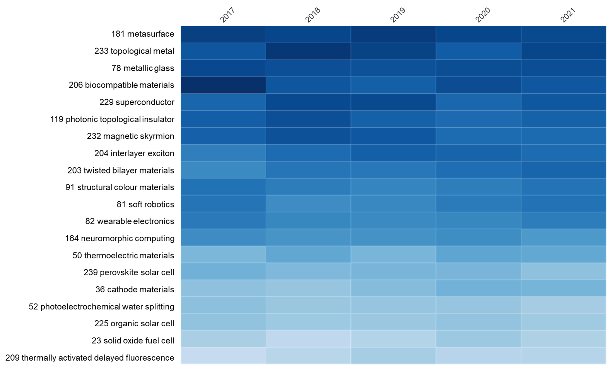

<h1 align="center">MaterialsScienceExplorer</h1>
<h3 align="center">Text-mined Academic Interests in Materials Science</h3>

</p>

Implementation of our paper "**Text-mined Academic Interests in Materials Science**".  

This study is a successful example of applying natural language processing and unsupervised learning for materials science trend analysis.
We applied the document embedding and density-based clustering to materials science literature.
We obtained the comprehensive understanding of scientific topics in materials science without any insertion of expertise.
We quantified the topic relevance of each paper and identified main topics and academic interests of organisations in a quantitative and time-aware manner.

## Dataset
Dataset used in this study is available here, and unzip in your own directory.

## Requirements
Our experiment setting is as follows:

gensim : 4.1.2

spacy : 3.2.4

hdbscan : 0.8.28

```bash
pip install -r requirements.txt
```
## Result

**Topic Map of Materials Science**



**National Interests of Materials Science**



**Heatmap of Nature Materials**



## Models

## Tutorial
**Coming soon!**


## Citation
If you utilise our findings, methods, or results, please consider citing the following paper.
